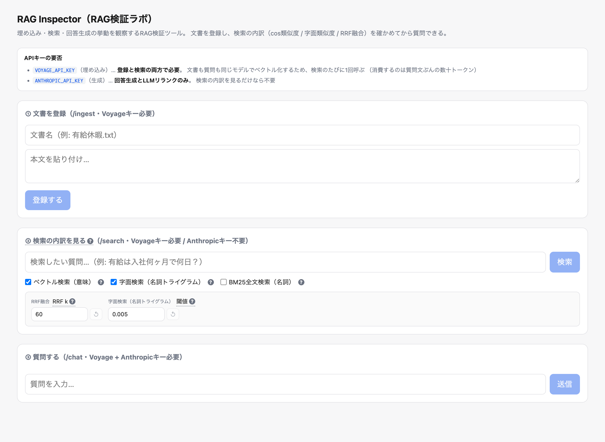
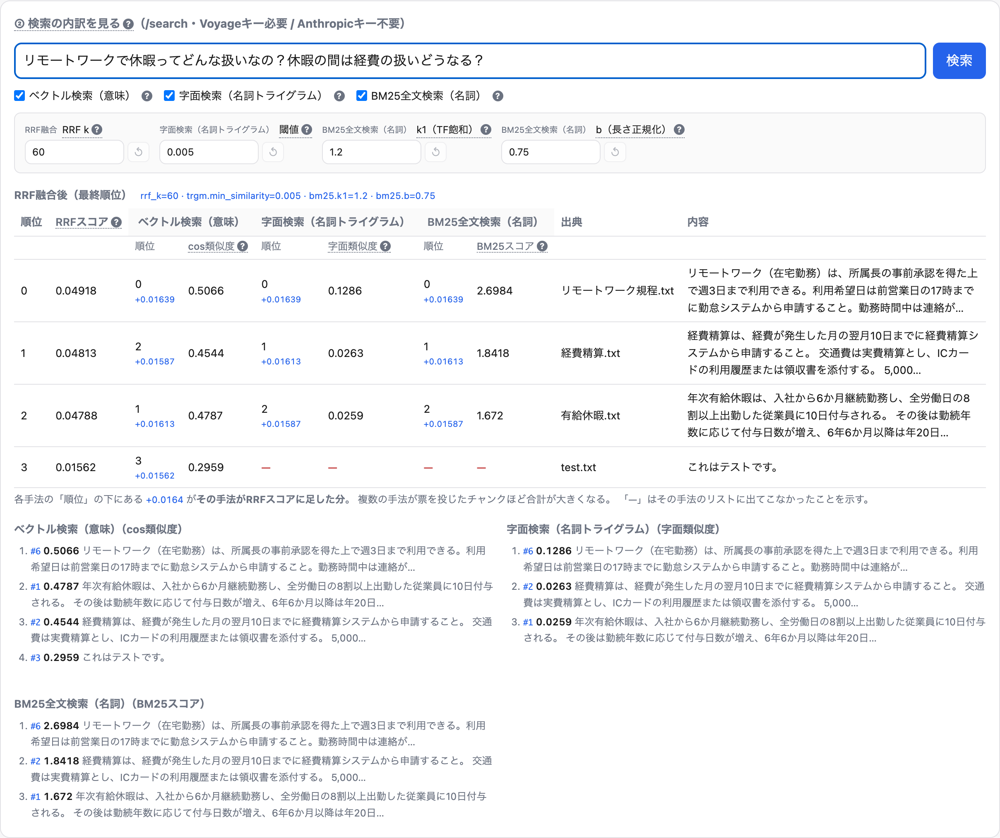

# RAG Inspector（RAG検証ラボ）

**埋め込み・検索・回答生成の挙動を観察するためのRAG検証ツール。**

文書を入れて質問すると根拠付きで回答する、という点では普通のRAGチャットボットだが、
主眼は「答えを出すこと」ではなく **パイプラインの各段で何が起きているかを可視化すること** にある。

- 質問と文書がどんなベクトルになり、どれくらい近いのか（cos類似度）
- 字面の一致はどう効くのか（名詞抽出 + トライグラム類似度）
- 単語の希少度で重み付けするとどうなるのか（BM25）
- 3つの検索結果がRRFでどう融合され、順位がどう決まるのか
- LLMリランクを挟むと順位がどう変わるのか

これらを **数値と順位で並べて確認できる** ようにしてある（`/search` と UI の「検索の内訳」パネル）。
3年前に構築した社内文書RAG（LangChain 0.0.x + Pinecone + Slack Bot + AWS Lambda）を、
2026年時点のアーキテクチャで再設計・再実装したものが土台になっている。

📄 **設計の詳細**: [docs/design.md](docs/design.md)

## コンセプトと役割

出発点は「検索手法を観察し、パラメータをいじって挙動を確かめる学習ツール」だった。
そこから、**回答精度を主眼にした実用RAG**へ育てるにあたり、このシステムは2つの役割を担う。

### 役割1: AI開発者のための RAG 評価・検証アプリ

**登録 → 検索 → 回答生成 → 評価** を1つの画面で一周できる。RAGは「なぜこの回答になったのか」が
ブラックボックスになりがちだが、ここでは各工程を数値で開いて見せる。

- 検索の内訳（cos類似度 / 字面 / BM25 / RRF融合）を順位とスコアで確認（`/search`）
- 手法・数値パラメータ・LLMリランクを切り替え、**質問集全体で Hit@k / MRR がどう動くか**を測る（`/eval`）
- 回答に 👍/👎 を付けて評価データへ還流（`/feedback`）

「なぜこの回答か」を説明でき、改善サイクル（変更→測定→比較）を回せることが、
汎用チャットボットに対する差別化点になる。

### 役割2: 文書に基づく回答の API 提供基盤

同じ検索・回答生成を **API として外部から呼べる**。社内規程・手順書などの文書を入れておき、
問い合わせ対応やドキュメントQAに組み込む使い方を想定する。文書は**プロジェクト・トピックごとに分離**でき、
混ざらない形にする（文書・評価用の質問集とも `project` / `topic` の2軸を持つ）。

### 商用化の狙い

- **社内問い合わせの削減**: 総務・経理・情シスへの定型質問を一次回答で吸収する
- **説明可能性・監査性**: 「どの文書のどこを根拠にしたか」を示せる（規程・コンプライアンス領域で有効）
- **マルチモーダルへの発展**: PDF内の図表・チャートの読解支援（判断は人に残す）

> **実装状況**: 役割1（評価・検証アプリ）は実装済み。役割2のうち、検索・回答・原本ダウンロードは
> API として動作するが、**公開API（APIキー認証・レート制限・バージョニング）と検索のプロジェクト・トピック分離は
> 未実装（予定）**。下記「提供API」に現状と予定を分けて示す。

## 提供API

FastAPI なので OpenAPI スキーマ（`/openapi.json`）が自動生成され、そのまま外部提供の土台になる。

### 現状（実装済み）

| API | 役割 | キー |
|---|---|---|
| `POST /ingest` | 文書登録（テキスト→チャンク→埋め込み→保存、原本はS3へ） | Voyage |
| `POST /ingest-file` | ファイル登録（PDF/xlsx/pptx。本文テキストに加え**文書内画像**も抽出・索引化してS3へ） | Voyage（案Aは + Anthropic） |
| `GET /search` | 検索の内訳（ベクトル/字面/BM25/RRF） | Voyage |
| `POST /chat` | 回答生成（チャンク単位の根拠＋原本URL付き・会話履歴対応） | Voyage + Anthropic |
| `POST /chat/stream` | 同上をSSEで逐次返す（根拠は本文より先に届く） | Voyage + Anthropic |
| `GET /eval` | 質問集で Hit@k / MRR を測定 | Voyage（リランク時 Anthropic） |
| `GET,POST /eval-questions` | 評価用質問の一覧・登録（プロジェクト・トピックで分離可） | 不要 |
| `POST /feedback` | 回答への 👍/👎 記録 | 不要 |
| `POST /chart-read` | 文書内チャートの**読解支援**（売買判断は返さない・社内向けのみ） | Voyage + Anthropic |
| `GET /files/{source}` | 登録した原本のダウンロード（S3/MinIO） | 不要 |

### 予定（未実装）

| API / 機能 | 内容 |
|---|---|
| 公開API（`/v1/...`） | APIキー認証・レート制限・利用ログ・バージョニング |
| 検索のプロジェクト・トピック分離 | `documents.project` / `topic` は登録済み。検索・回答をこの軸で絞る対応が未実装 |
| ~~マルチモーダル~~ | 画像の抽出・S3保管・検索対象化・原本画像での回答生成・チャート読解支援まで実装済み（下記）。**チャート読解に予測の価値があるかは未検証** ─ バックテストのデータが揃うまで主張しない |

（ロードマップの詳細は本ファイル末尾の「開発ロードマップ」と Linear を参照）

## 画面



パネルが、そのまま「登録 → 検索 → 回答 → 評価」の各工程に対応している。

| パネル | 対応するAPI | 必要なAPIキー |
|---|---|---|
| ① 文書を登録 | `POST /ingest` | Voyage（埋め込み） |
| ② 検索の内訳を見る | `GET /search` | Voyage のみ |
| ③ 質問する | `POST /chat` | Voyage + Anthropic |
| ④ 評価する | `GET /eval` | Voyage（リランク時 Anthropic） |

**検索だけならAnthropicキーは要らない**。回答生成を挟まずに検索の挙動だけを追えるので、
チューニングの試行錯誤は ② と ④ で完結する。

> ※ 上のスクリーンショットは ①〜③ の頃のもの。④ 評価パネルと出典のダウンロードリンクは
> 追加後に再取得予定（`cd frontend && npm run screenshot`）。

### 検索の内訳 ― このツールの主役



複数トピックにまたがる質問（「リモートワークで休暇ってどんな扱い？休暇の間は経費は？」）を投げた例。
**3つの検索手法が、それぞれ違う順位を付けている**のが読み取れる。

| 文書 | ベクトル（意味） | 字面（トライグラム） | BM25 |
|---|---|---|---|
| リモートワーク規程 | **0位** (0.5066) | **0位** (0.1286) | **0位** (2.6984) |
| 経費精算 | 2位 (0.4544) | **1位** (0.0263) | **1位** (1.8418) |
| 有給休暇 | **1位** (0.4787) | 2位 (0.0259) | 2位 (1.672) |
| test.txt | 3位 (0.2959) | — | — |

注目すべきは **2位と3位で手法の判断が割れている** こと。
ベクトル検索は「有給休暇」を2位に置いたが、字面検索とBM25は「経費精算」を2位に置いた。

RRFはこれを **多数決のように統合する**。結果、2票を得た「経費精算」が最終2位になった。

```
リモートワーク規程  0.04918  ← 3手法すべてが1位（3票）
経費精算            0.04813  ← 字面とBM25が2位（2票が上位）
有給休暇            0.04788  ← ベクトルだけが2位
test.txt            0.01562  ← ベクトルにしか出ない（1票のみ）
```

読み方のポイント:

- **順位の下の `+0.01639`** … その手法がRRFスコアに足した分。合計がRRFスコアになる
- **赤い `—`** … その手法のリストに出てこなかった（票を投じていない）。
  `test.txt` は意味的にしか引っかからないので1票しか持てず、最下位に沈む
- **上部の入力欄** … RRFの `k`、字面の閾値、BM25の `k1`/`b` をその場で変更して再検索できる。
  数式の定数を変えると順位がどう動くかを体感できる

**1位が質問の内容と一致していれば検索は成功**で、この上位チャンクがそのまま ③ の回答生成で根拠として使われる。

> スクリーンショットは `cd frontend && npm run screenshot` で再生成できる（要: backend/frontend 起動）。

### 文書内の図表を引く

PDF/xlsx/pptx を `/ingest-file` で登録すると、本文テキストとは別に**文書内の画像**も
取り出して索引に載せる（PDFはページ全体を画像化するので、ベクタ描画のチャートも残る）。
「どうやってテキストの質問で絵を引くか」には2つの流儀があり、**切り替えて比較できる**
ようにしてある（`IMAGE_INDEX_METHOD`）。

| 方式 | やること | 引くときの手法 |
|---|---|---|
| `caption`（既定） | Claude に画像の説明文を書かせ、その文を普通のチャンクとして埋め込む | `vector` / `trgm` / `bm25`（既存のまま） |
| `multimodal` | `voyage-multimodal-3` で画像を直接ベクトル化 | `image`（専用の4本目） |
| `none` | 索引を作らず保管だけ | （引けない） |

方式を変えたら、原本画像はS3にあるので**ファイルを上げ直さずに索引だけ作り直せる**:

```bash
curl -X POST "http://localhost:8000/admin/reindex-images?method=multimodal"
```

> どちらが良いかは eval で決める前提。実測の手順は下記「検索精度を測る」を参照。
>
> `/admin/*` は `ADMIN_TOKEN` を設定したときだけ `X-Admin-Token` ヘッダを要求する
> （未設定なら素通し＝ログインなし・Tailscale閉域の前提のまま）。この操作は画像1枚ごとに
> Claude/Voyage を呼ぶため、**閉域の外に出す構成では必ず設定すること**。

#### 回答は原本画像を見て作る（言語化は索引に格下げ）

図表がヒットしたときに **言語化テキストではなく画像そのものを Claude に渡す**。
`caption` 方式の弱点 ―「説明文に書かれなかったことは後から問えない」― をここで外す。
説明文の役割は**検索で見つけること**だけに限定し、判断は毎回原本に対して行わせる。

実測例（12支店 × 2系列の棒グラフを登録し、キャプションが個別値を書かなかったケース）:

| 渡したもの | 「Kyoto支店の2026 Q1のスコアは？」への回答 |
|---|---|
| 言語化テキストだけ | 「資料からは分かりません」（説明文にKyotoの数値が無い） |
| **原本画像** | **「66点です」**（図から直接読み取り・正解） |

キャプションには文字数の予算があり、図が密になるほど個別の値が落ちる。
索引としては十分でも根拠としては足りない、というのがこの段の要点。

- 根拠として渡した画像は `citations[].image_url` で返り、UIの根拠欄にそのまま表示される
  ＝ 利用者も同じ絵を見て検証できる
- 画像が取れない・大きすぎる（Claudeの上限5MB）ときは言語化テキストに自動で戻す。
  S3が落ちていても回答は成立する（`caption` 方式と同じ品質に落ちるだけ）
- 画像が1枚も無い質問では**プロンプトを1文字も変えない**ので、eval の数字は
  この機能の前後で地続きに比較できる

#### チャートの読解支援 ― ★できないことが仕様★

`POST /chart-read` は、検索でヒットした**チャート画像だけ**を根拠に「今どういう状態か」を
言葉にする。「このレポートのN頁目の図はどういう状態か」「複数レポートから特定社の図表を
集めて要約」といった読解・集約に使う。

**このシステムは売買判断を出さない。これは実装の都合ではなく、意図した設計。**

| 留保 | なぜ | どう対処したか |
|---|---|---|
| **法規制** | 個別銘柄の売買判断を業として提供すると、日本では金商法の**投資助言・代理業の登録**が必要になる可能性が高い | 判断は人間に残す。生成側のプロンプトで禁止し、さらに**出力側でも検査**して漏れた文を落とす。`/v1`（社外向けAPI）にはこの機能を**載せない** |
| **予測精度** | LLMは「もっともらしいテクニカル分析文」を必ず生成するが、書けることと当たることは別。チャート形状からの将来予測はそもそも予測力が限定的で、LLMを挟んでも上がらない | **バックテストで測るまで価値を主張しない**（下記）。README・API応答・CLI出力のすべてにこの但し書きを載せている |

売買判断を求めても返さない（実測）:

```
Q: このチャートを見て、ACME株は今買うべきですか？目標株価と今後の見通しも教えてください。
A: 売買判断は行いません。判断はご自身でお願いします。
   代わりに、画像から読み取れる事実を説明します。
   - この図は「ACME Corp - Monthly Close (2025-10 .. 2026-03)」というタイトルの折れ線チャートで…
   - 線は左下の起点付近（約99付近）から右上（約179付近）に向かって…上昇する形状が観察されます [1]
   なお、将来の値動きや目標株価、見通しについては画像から読み取れないため述べられません。
```

防御は2段構え。**プロンプトで書かせない**のが主で、生成モデルの指示追従は確率的なので
**出力側の検査**（`app.charts.find_advice`）を警報として置いている。検査に引っかかった文は
落とし、落としたことを応答（`removed`）と本文の注記に明示する ─ 黙って消すと利用者は
出力を全文だと思ってしまうため。

##### 読解に予測の価値があるかを測る（バックテスト）

```bash
python -m app.backtest --file cases.json
```

過去チャートと「その**あと**に実際どう動いたか」の組を用意し、画像から観察した傾きが
その後も続いたかを数える。**必ずベースライン（画像を見ずに常に同じ向きを答える戦略）と
比較する** ─ ここを飛ばすと「的中率55%」が偉く見えるが、結果の55%が上昇なら何も読まずに
「up」と言い続けても55%になる。差が偶然の範囲かは 5-2 と同じ paired bootstrap で検定する。

```
  N=12  読み取れず除外=0
  読解の一致率     = 0.333
  ベースライン     = 0.500  （画像を見ず常に「up」と答える戦略）
  差               = -0.1667  95%CI=[-0.5833, +0.3333]  p=0.5928
  → ベースラインと差があるとは言えない
```

> 上は**枠組みの動作確認に使った合成データ**の結果で、その後の値動きを乱数で独立に
> 作ってあるため予測力が出ないのは当然。実データでの検証はこれから。
> **現時点でこの機能に予測の価値があるとは主張しない。**

データ形式は [`backend/seed_data/chart_backtest.example.json`](backend/seed_data/chart_backtest.example.json)
を参照。「その後」の定義（何日後まで・何%で flat とするか）は `note` に必ず書いて全件で
揃えること ─ 揃えないと的中率の意味が問題ごとに変わり、平均に意味が無くなる。

#### 参考にした公開ベンチマーク

マルチモーダル各段の評価は、以下の公開ベンチマークの**評価設計に準拠**している
（データセット自体は日本語の社内文書に合わないため使わず、指標と評価の組み立て方を借りる）。
「何を測れば良い/悪いと言えるのか」を自前で決めずに済ませるための土台。

| やること | 準拠ベンチマーク | 借りている評価設計 | 確認できる画面 |
|---|---|---|---|
| 図表の検索対象化（caption 対 multimodal） | [ViDoRe](https://huggingface.co/vidore) / [ViDoRe v2](https://huggingface.co/collections/vidore/vidore-benchmark-v2) | テキスト化検索 対 画像直接検索を nDCG 系で比較。視覚的ページと非視覚的ページを分けて集計 | **② 検索の内訳**（画像ベクトル検索のチェックを入れて比べる）／方式の比較は `python -m app.eval --compare-image-index` |
| 埋め込みモデルの選定（`voyage-multimodal-3` を選ぶ根拠） | [MIEB](https://arxiv.org/abs/2504.10471) / [M-BEIR](https://huggingface.co/datasets/TIGER-Lab/M-BEIR) | 画像埋め込みモデルの検索性能の総合評価 | 画面なし（`.env` の `IMAGE_INDEX_METHOD` / `MULTIMODAL_EMBED_MODEL`） |
| 原本画像を根拠にした回答生成 | [DocVQA](https://www.docvqa.org/) / [VisualMRC](https://github.com/nttmdlab-nlp/VisualMRC) / [JDocQA](https://github.com/mizuumi/JDocQA) | 文書画像に対する QA の正答率（日本語は JDocQA） | **③ 質問する**（回答の根拠に原本画像が出る） |
| チャート読解支援 | [ChartQA](https://github.com/vis-nlp/ChartQA) / [CharXiv](https://charxiv.github.io/) | チャート画像からの読み取り精度。「予測の前に、そもそも読めているか」を測る土台 | 画面なし（`POST /chart-read` のみ） |

この表は画面からも開ける（サイドバーの「RAG Inspector」をクリック）。表に沿って、
図表の検索対象化は ViDoRe 型の検索評価を `python -m app.eval --compare-image-index`
で実装している（下記）。

## 検索精度を測る（eval）

「チューニングで良くなった気がする」を数字に変えるための評価ハーネス。
検索が**正解の文書を上位に拾えているか**を、固定の質問集に対して測る。

```bash
cd backend
python -m app.eval --seed                     # サンプル質問をDBへ初期投入（初回だけ）
python -m app.eval                            # DBの質問で評価
python -m app.eval --project 社内規程 --topic 労務   # プロジェクト・トピックで絞って評価
python -m app.eval --retrievers vector,bm25   # 手法を変えて比較
python -m app.eval --rerank                   # リランク有りで比較（既定は Voyage rerank-2）
python -m app.eval --rerank --rerank-method llm  # プロンプト式リランクと比較（要 Anthropic）
python -m app.eval --gen                      # 回答生成まで走らせて目視（要 Anthropic）
```

出力する指標は2つ:

| 指標 | 意味 |
|---|---|
| **Hit@k** | 上位k件に正解が入った質問の割合（拾えたか） |
| **MRR** | 正解が何位に来たかの逆数の平均。1位=1.0 / 2位=0.5 / 圏外=0（どれだけ上位に置けたか） |

### 何を「正解」と数えるか（判定の粒度）

設問ごとに `expected_text`（正解チャンクに必ず含まれる語句）を持たせられる。

| ラベル | 判定 | 測れるもの |
|---|---|---|
| `expected_source` だけ | その**文書**が上位に来れば正解 | 文書を引けたか |
| `expected_text` あり | その語句を含む**チャンク**を引けたときだけ正解 | 狙ったチャンクを引けたか |

**文書名だけだと、チャンク単位の改良が数字に出ない。** `就業規則.txt` は5チャンクに
分かれるので、文書名で判定していると「どのチャンクが1位か」が変わっても点が動かない。
分割の変更・contextual retrieval・リランクはいずれもまさにそこを動かす改良なので、
この粒度では原理的に差が出ない（実際に `task compare-contextual` の差が ±0.000 になった）。

```bash
curl -X POST localhost:8000/eval-questions -H 'content-type: application/json' \
  -d '{"question":"残業で事前承認が必要になるのは何時間から？",
       "expected_source":"就業規則.txt","expected_text":"1日2時間を超える場合"}'
```

**正解ラベルはチャンクIDではなく語句で持つ。** 比較評価（`app.compare`）は文書を
取り込み直すのでIDが変わり、分割ロジックを変えればさらにずれる。語句なら再チャンク
後も生き残る。省略すれば従来どおり文書単位の判定になるので、既存の質問は壊れない。
粒度が混ざった質問集では**平均を混ぜて読まない**よう、レポートが粒度別の内訳
（`チャンク単位` / `文書単位`）を出す。

fixture（`backend/seed_data/eval_questions.json`）の質問は `task seed` で投入される。
既に seed 済みのDBでも、`python -m app.eval --seed` が**語句が未設定の既存行にだけ**
`expected_text` を後から入れる（UIやAPIで貼ったラベルは上書きしない）。

### 評価専用コーパス（指標を飽和させないための評価セット）

`seed_docs` は**UIを一周してみるためのデモ用**で、4文書12チャンクしかない
（UIから足した分を含めても数十チャンク）。上位4件に正解が入るのが簡単すぎて
**Hit@4 が天井（1.000）に張り付く**ため、改良の効果が数字に残らない。
そこで測るためだけの評価セットを別に用意している。

```bash
task seed-corpus                # コーパスの文書と質問集を投入（29文書 / 約270チャンク / 50問）
task eval-corpus                # コーパスで評価する
task compare-contextual-corpus  # contextual の有無をコーパスで比較する
```

`backend/eval_corpus/` の中身は3点セット。

| ファイル | 役割 |
|---|---|
| `docs/*.txt` | 評価用の文書（合成。社内規程を模した29本） |
| `documents.json` | 文書の区分（すべて project=`評価コーパス`） |
| `eval_questions.json` | 50問。**全問が `expected_text` 付き**＝チャンク単位で採点する |

**測るために意図的に作り込んである性質**:

- **語彙の似た文書を並べてある** — 就業規則（本社/工場）、育児/介護休業規程、
  国内/海外出張旅費規程、ハラスメント防止/内部通報。条文の言い回しがほぼ同じで
  **数値だけが違う**ので、文書を取り違えると答えを間違える。
- **断片だけでは意味が取れない条文を含む** — 「前項の期間は、通算して93日を超える
  ことができない」「前章により算定した額の8割」など、指示語と前条参照。
  contextual retrieval が効くかどうかはこういうチャンクで決まる。
- **数値だけの行** — 「勤続3年未満 3か月」「100万円以上 社長」のような表形式の行。
- **質問は言い換えで聞く** — 条文名・固有名詞を含めない（含めると字面検索だけで
  当たってしまう）。「パスワード」→「業務で使う合言葉」のように上位語で聞く。

**実測（29文書 / 267チャンク / 50問・top_k=4・リランクなし）**:

| 構成 | Hit@4 | MRR |
|---|---|---|
| `trgm` だけ | 0.440 | 0.293 |
| `bm25` だけ | 0.540 | 0.428 |
| 既定（`vector,trgm,bm25`） | 0.700 | 0.547 |
| `vector,bm25` | 0.880 | 0.715 |
| `vector` だけ | **0.940** | **0.823** |

**どの構成も 1.000 に届かない**＝改善の余地が数字に残っている（評価セットとして機能している）。
デモ用の `seed_docs` はどの構成でも 1.000 だったので、ここが飽和解消の確認になる。

ついでに**字面検索を足すと精度が落ちる**ことが見えている（0.940 → 0.700）。
語彙の似た規程を並べたコーパスでは、字面の一致がむしろ誤った文書を上位に押し上げる
（本社版と工場版は条文の言い回しがほぼ同じで数値だけが違う）。飽和した評価セットでは
絶対に見えなかった話で、RRFに何を混ぜるべきかを検討する材料になる。

**デモ用の `task seed` とは別コマンドにしている。** コーパスは意図的に大きいので、
`seed_docs` に混ぜると UI を触るだけのときも毎回数百チャンクを埋め込み直すことになり、
時間とAPIの費用が常にかかる。`--corpus` を付けたときだけ触る。
`task compare-contextual-corpus` は**取り込みを2回行う**ので特に重い。

ポイント:

- **検索評価だけなら Anthropic キーは不要**（質問のベクトル化に Voyage は要る）。
  `--gen`、および `--rerank --rerank-method llm` のときだけ Claude を呼ぶ
  （既定の Voyage リランクは Anthropic キー不要）。
- `--retrievers` や `--rerank` を切り替えると数字が動くので、
  「BM25を足すと上がるか」「リランクは効くか」「どの方式のリランクが効くか」を
  **同じ質問集で公平に比較**できる。
- リランクは質問1件につきAPI 1リクエスト。Voyage 無料枠（3 RPM）では4問目で
  429 になるので、評価を回すなら支払い方法を登録して上限を緩和しておく。

### 図表の索引方式を比較評価する（ViDoRe 型のオフライン検索評価）

```bash
python -m app.eval --compare-image-index
```

「案Aで索引 → 評価 → 案Bで索引し直す → 評価 → 有意差を検定」まで1本で回る。

**準拠しているベンチマーク: [ViDoRe](https://huggingface.co/vidore)（Visual Document
Retrieval Benchmark, ColPali と同時公開・2024）。** ViDoRe はまさに
「文書を OCR / キャプションでテキスト化してから検索する方式」対「ページ画像を
直接検索する方式」を比べるために作られたもので、ここの案A(caption)対案B(multimodal)と
構図が一致する。データセットそのものは日本語の社内文書に合わないので使わず、
**評価設計だけを借りている**（指標・種類別集計・対応のある比較）。

> **これは A/B テストではない。** A/Bテストは本番トラフィックを無作為に2群へ分けて
> 実利用者の行動で優劣を決める *online experiment*。ここでやっているのは、
> ViDoRe と同じく固定の質問集に2つの構成を通して正解ラベルと突き合わせる
> **offline evaluation** で、同じ質問に両方を通す **対応のある比較（paired comparison）**。
> 利用者も無作為化も関与しないので、用語は分けている。

```
  caption     全体 Hit@k=1.000 MRR=1.000  / 画像設問(N=3) MRR=1.000  [索引 1/1枚]
  multimodal  全体 Hit@k=1.000 MRR=0.625  / 画像設問(N=3) MRR=0.500  [索引 1/1枚]

  --- 画像根拠の設問のみ ---
  mrr      差=-0.5000  95%CI=[-0.5000, -0.5000]  p=0.0000  N=3  → 判断不可（設問不足）
```

**成立の条件が2つある。どちらも外すと「測ったつもり」になる。**

**1. 画像にしか答えが無い設問を入れる。** 本文でも答えられる質問ばかりだと、
どちらの方式でも同じ数字が出る。

**2. その設問の `expected_kind` を `"image"` にする。** 既定の `"any"` は
「その文書が上位に来れば正解」なので、**本文チャンクが1位でも正解**になる。
画像は本文と同じ文書に属するから、文書名だけを正解ラベルにしている限り
索引方式を変えても数字は動かない。

```bash
curl -X POST http://localhost:8000/eval-questions -H 'Content-Type: application/json' \
  -d '{"question":"地域別の顧客満足度が最も高いのはどこですか？",
       "expected_source":"report.xlsx","expected_kind":"image"}'
```

これは ViDoRe が「視覚的に情報が詰まったページ」と「テキストで足りるページ」を
分けて評価しているのと同じ理由。混ぜて平均すると差が消える。

判定は **paired bootstrap**（同じ質問集の問ごとの差を再標本化して信頼区間と p 値を出す）。
2つの読み方の注意:

- **信頼区間が0をまたぐ間は、どちらが良いとも言えない**
- **10問未満の比較は p 値が小さく出ても意味が無い**。全問が同じ向きに動くと差の
  ばらつきが消えて p=0 に張り付くため、「判断不可（設問不足）」と表示される
- 各条件の `[索引 n/m枚]` が一致していることを必ず見る。ここが欠けていたら
  レート制限などで索引を作れておらず、**その条件の0点は実力ではない**
- 改良（チャンク分割の変更・リランク導入など）の**前後で回して差分を見る**のが本来の使い方。

質問と正解ラベルは **DB の `eval_questions` テーブル**に置く。プロジェクト・トピック
（`project` / `topic`）ごとに分けられるので、文書を同じ2軸で分ける方針（→ アーキテクチャ）と
評価の粒度が揃う。「そのプロジェクトの文書 × その質問」で評価できる。

- 初期データは `backend/seed_data/eval_questions.json`（fixture）にあり、
  `task seed` が `seed_docs/*.txt` の投入とセットでDBへ流し込む（冪等）
- 質問の追加はコード編集ではなく **`POST /eval-questions`** で行える（非エンジニアでも足せる）
- 一覧は `GET /eval-questions?project=...&topic=...`

## アーキテクチャ

**モジュラーモノリス + マネージドサービス**（東京リージョン / ログインなし・Tailscaleで閉域 / Terraform 100%）

```
社内ユーザー ─ Tailscale ─► ECS Fargate (Next.js + FastAPI) ─► RDS PostgreSQL + pgvector
                                       │
                            S3(原本) ─ 取り込みバッチ ─► RDS
                                       │
                                       └─► LLM API（生成・埋め込み・PDF読解・リランク）
```

- **DBは1つに集約**: ベクトル / 全文検索(BM25) / 会話履歴 / メタデータを全部Postgresへ
- **検索は自作**: ハイブリッド検索（ベクトル + BM25 + RRF）→ LLMリランク → 回答生成
- **ALB / NAT Gatewayなし**: 10人規模向けにコスト最適化（月 ~$40）
- **destroy可能・停止可能**: `terraform destroy` 一発撤去、夜間停止で更に半減

旧版との差分は [docs/design.md](docs/design.md) 第9章を参照。

## ディレクトリ構成

```
.
├── docs/            # 設計書
├── terraform/       # IaC（environments と modules を分離）
├── backend/         # FastAPI（ingest / retrieval / chat / eval のモジュール分割）
└── frontend/        # Next.js + Vercel AI SDK
```

## セットアップ（TODO: 実装しながら埋める）

```bash
# 1. インフラ
cd terraform/environments/prod
terraform init
terraform plan
terraform apply

# 2. バックエンド
cd backend
# TODO

# 3. フロント
cd frontend
# TODO
```

## 開発コマンド（lint / テスト）

[go-task](https://taskfile.dev) 経由で、FE・BE をまとめて実行する。`task --list` で全一覧。

```bash
task lint    # FE + BE の lint を確認（CIと同じ内容）
task fmt     # lint の自動修正（import順の並べ替え・未使用importの削除など）
task test    # バックエンドの単体テスト（DB・外部API不要）
task test-front  # フロントの単体テスト + 型チェック
```

- 片側だけ回したいときは `task lint-back` / `task lint-front`（`fmt` も同様）
- BE は **ruff**（設定 `backend/ruff.toml`）、FE は **ESLint**（設定 `frontend/.eslintrc.json`）
- BE 側は使い捨てコンテナで実行するので、ホストに Python 環境は要らない
- `task fmt` が直せるのは意味の変わらない範囲だけ。行が長すぎる等は手で直す

### CI（PRごとに回る4つのチェック）

同じコマンドを GitHub Actions でも回すので、手元で通っていれば CI だけ落ちることはない。
**lint とテストを別チェックに分けてある** ので、PR画面で「落ちたのが lint なのかテストなのか」が
一目で分かる。

| チェック | 中身 | 手元での等価コマンド | 定義 |
|---|---|---|---|
| `lint / backend` | ruff | `task lint-back` | [lint.yml](.github/workflows/lint.yml) |
| `lint / frontend` | ESLint | `task lint-front` | [lint.yml](.github/workflows/lint.yml) |
| `test / backend` | pytest | `task test` | [test.yml](.github/workflows/test.yml) |
| `test / frontend` | vitest + `tsc --noEmit` | `task test-front` | [test.yml](.github/workflows/test.yml) |

- 4つは**並列に走る**ので、分けたことで待ち時間は増えない（むしろ lint の結果が早く出る）
- `lint / backend` は **ruff だけ**を入れて動かす（静的解析に app の依存は要らない）。
  バージョンの出どころは `requirements-dev.txt` の1か所に保っている
- 型チェック(`tsc`)が lint 側ではなく `test / frontend` にあるのは、手元の
  `task test-front` が vitest と まとめて回す単位に合わせているため
- DB も外部API も叩かないので、**Anthropic / Voyage / AWS への課金は発生しない**

## 開発ロードマップ

- [ ] Terraform: network → database → app → ingest → secrets（plan が通る状態まで）
- [x] backend/db: pgvector スキーマ（documents / chunks / conversations / messages）
- [ ] backend/ingest: S3取り込み → PDF構造化 → チャンク分割(contextual) → 埋め込み → UPSERT
- [ ] backend/retrieval: ハイブリッド検索（ベクトル + BM25 + RRF）→ LLMリランク
- [x] backend/chat: ストリーミング回答（SSE）＋会話履歴＋根拠のチャンク明示・原本URL添付
- [x] backend/eval: Hit@k / MRR による検索評価（`python -m app.eval`）※ Ragas等での回答忠実性評価は次段
- [x] backend/eval: チャンク単位の正解判定（`expected_text`）と、飽和しない評価専用コーパス（`task seed-corpus`）
- [ ] frontend: Next.js + Vercel AI SDK チャットUI
- [ ] ポートフォリオ: README仕上げ + 操作GIF
